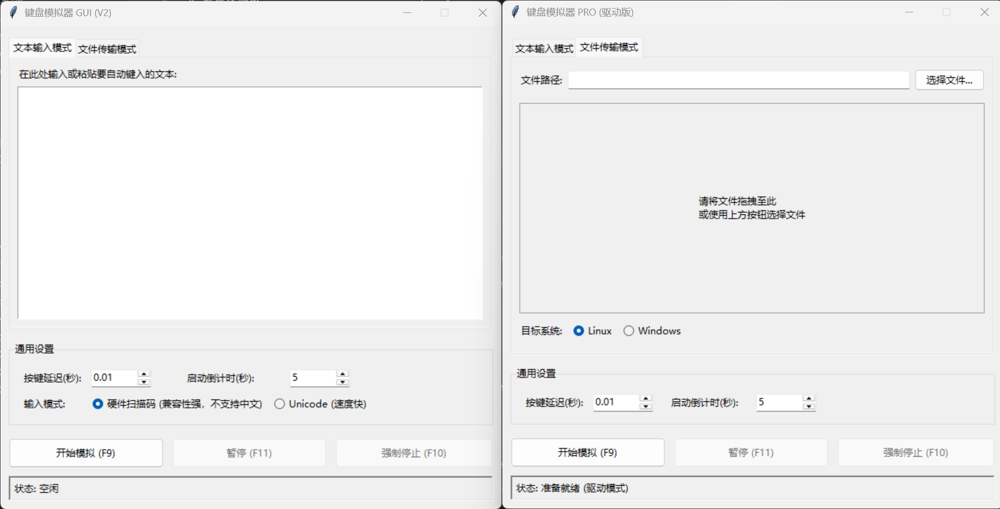

# 键盘模拟器

跨虚拟机键盘模拟器，帮助你在 VMware、VirtualBox、远程桌面和各种受限环境中“粘贴”文本或文件。

---

## ⏬ 下载 (推荐)

我们为普通用户提供了已打包好的可执行程序 (`.exe`)，无需安装 Python 或任何依赖。

**[➡️ 前往最新发布页面下载](https://github.com/CertStone/keyboard_simulator/releases/latest)**

下载 `KeyboardSimulator-vX.X.X.zip` 并解压后，你会看到以下主要文件：

- `KeyboardSimulatorGUI.exe`: **标准图形界面版**，适用于大多数日常场景。
- `KeyboardSimulatorPro.exe`: **专业图形界面版**，用于解决高难度兼容性问题。

> **注意**: Pro 版本需要额外安装驱动，请务必阅读压缩包内的 **[PRO 版专属指南 (README_PRO.md)](./README_PRO.md)**。

---

## 📖 了解不同版本

本项目提供三种工具，以满足不同用户的需求。请根据下表选择最适合你的版本：

| 版本 | 工具名称 | 主要特点 | 适用场景 |
| :--- | :--- | :--- | :--- |
| **命令行版 (CLI)** | `keyboard-simulator` | 自动化、可脚本化、无界面 | 在批处理或自动化脚本中快速执行输入任务。 |
| **图形界面版 (GUI)** | `KeyboardSimulatorGUI.exe` | 操作直观、功能全面、兼容性好 | 日常使用，支持热键、文件拖拽、暂停/恢复。 |
| **专业版 (PRO)** | `KeyboardSimulatorPro.exe` | **兼容性最强**、驱动级模拟 | 在高防护软件、游戏或标准版无效的苛刻环境中使用。 |

### 使用指南
- **标准版 GUI**: 功能与操作方法请直接参考 [GUI 程序界面](#-gui-界面概览)。
- **PRO 版**: 需要额外安装驱动，请务必阅读 **[PRO 版专属指南 (README_PRO.md)](./README_PRO.md)**。
- **命令行版**: 参数与用法请参考 **[CLI 专属指南 (README_CLI.md)](./README_CLI.md)**。

---

## 💻 为开发者：快速开始与贡献

如果你希望从源码运行、修改代码或参与贡献，请遵循以下步骤。

1.  **安装**:
    首先，克隆本仓库并安装基础依赖。我们推荐在虚拟环境中进行。
    ```powershell
    git clone https://github.com/CertStone/keyboard_simulator.git
    cd keyboard_simulator
    pip install -e .
    ```

2.  **深入了解**:
    - **贡献流程**: 如果您打算贡献代码，请先阅读 **[贡献指南 (CONTRIBUTING.md)](./CONTRIBUTING.md)**，其中详细说明了开发环境搭建、代码风格和提交流程。
    - **技术架构**: 如果您想深入了解项目的设计思路、模块划分和核心流程，请查阅 **[项目架构文档 (docs/ARCHITECTURE.md)](./docs/ARCHITECTURE.md)**。

---

## 📦 打包与发布

项目使用 PyInstaller 进行打包，并通过 GitHub Actions 自动发布。

- **手动打包**:
  ```powershell
  # 安装构建依赖
  pip install -e .[build]
  # 执行打包
  python build/pyinstaller_build.py all
  ```
- **自动发布**:
  当 `main` 分支上创建并推送一个新的 `v*` 标签时，GitHub Actions 会自动构建所有可执行文件，并将其上传到新的 Release 中。

---

##  GUI 界面概览

 

1.  **模式选择**: 通过顶部的标签页在“文本输入”和“文件传输”之间切换。
2.  **参数配置**: 设置按键延迟、启动倒计时和输入模式（扫描码或 Unicode）。
3.  **控制按钮**:
    - **开始 (F9)**: 启动模拟任务。
    - **暂停/恢复 (F11)**: 在任务执行期间暂停或恢复。
    - **强制停止 (F10)**: 立即中止任务。
4.  **状态栏**: 显示当前任务状态，如“空闲”、“运行中”、“已完成”等。

---

## 📄 许可

本项目采用 [MIT License](./LICENSE)。