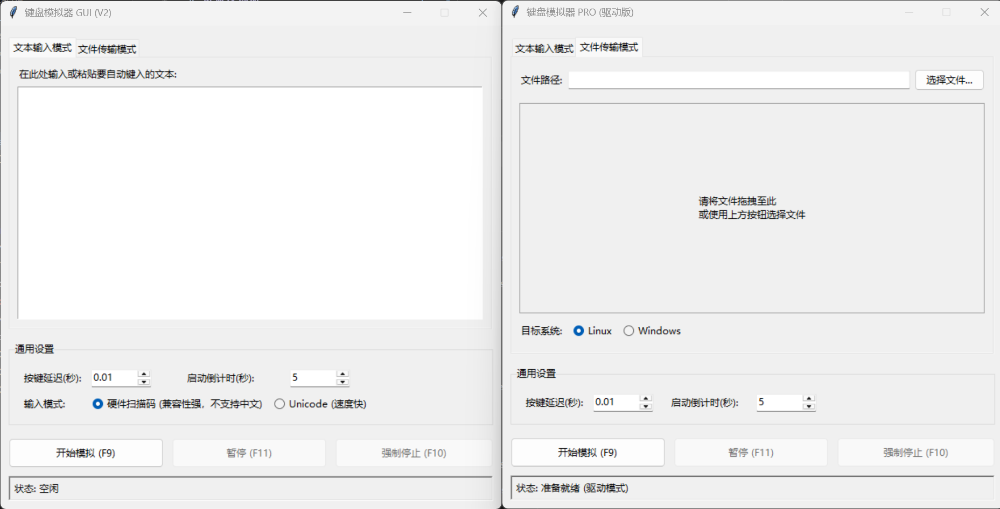

# 键盘模拟器

跨虚拟机键盘模拟器，帮助你在 VMware、VirtualBox、远程桌面和各种受限环境中“粘贴”文本或文件。

---

## ⏬ 下载 (推荐)

我们为普通用户提供了已打包好的可执行程序 (`.exe`)，无需安装 Python 或任何依赖。

**[➡️ 前往最新发布页面下载](https://github.com/CertStone/keyboard_simulator/releases/latest)**

在 Release 页面底部的 Assets 区域，直接下载以下可执行文件之一：

- `KeyboardSimulatorGUI.exe`：标准图形界面版，适用于大多数日常场景。
- `KeyboardSimulatorPro.exe`：专业图形界面版，用于解决高难度兼容性问题（首次使用需安装驱动，见下）。

### Interception 驱动快速安装（仅 PRO 版需要）

1) 下载并解压 Interception 驱动：
   https://github.com/oblitum/Interception/releases/latest （文件名通常为 `Interception.zip`）
2) 以管理员身份打开 CMD 或 PowerShell，进入解压目录下的 `command line installer` 子目录：
   ```cmd
   cd C:\Interception\"command line installer"
   install-interception.exe /install
   ```
3) 看到 “Interception successfully installed.” 提示即为成功。
4) 重启电脑后，双击运行 `KeyboardSimulatorPro.exe` 即可。

> 提示：如需源码运行、开发或排错，请参考下文“为开发者”以及 [README_PRO.md](./README_PRO.md) 的“源码版（开发者）”章节。

---

## 📖 了解不同版本

本项目提供三种工具，以满足不同用户的需求。请根据下表选择最适合你的版本：

| 版本 | 工具名称 | 主要特点 | 适用场景 |
| :--- | :--- | :--- | :--- |
| **命令行版 (CLI)** | `keyboard-simulator` | 自动化、可脚本化、无界面 | 在批处理或自动化脚本中快速执行输入任务。 |
| **图形界面版 (GUI)** | `KeyboardSimulatorGUI.exe` | 操作直观、功能全面、兼容性好 | 日常使用，支持热键、文件拖拽、暂停/恢复。 |
| **专业版 (PRO)** | `KeyboardSimulatorPro.exe` | 兼容性最强、驱动级模拟 | 在高防护软件、游戏或标准版无效的苛刻环境中使用。 |

### 使用指南
- 标准版 GUI：功能与操作方法请直接参考 [GUI 程序界面](#-gui-界面概览)。
- PRO 版：打包版用户按上方“Interception 驱动快速安装”步骤完成后直接运行；源码用户请阅读 **[README_PRO.md](./README_PRO.md)**。
- 命令行版：参数与用法请参考 **[README_CLI.md](./README_CLI.md)**。

---

## 💻 为开发者：快速开始与贡献

如果你希望从源码运行、修改代码或参与贡献，请遵循以下步骤。

1.  安装：
    ```powershell
    git clone https://github.com/CertStone/keyboard_simulator.git
    cd keyboard_simulator
    pip install -e .
    ```
2.  深入了解：
    - 贡献流程：请阅读 **[CONTRIBUTING.md](./CONTRIBUTING.md)**。
    - 技术架构：请查阅 **[docs/ARCHITECTURE.md](./docs/ARCHITECTURE.md)**。

---

## 📦 打包与发布

项目使用 PyInstaller 进行打包，并通过 GitHub Actions 自动发布。

- 手动打包：
  ```powershell
  pip install -e .[build]
  python build/pyinstaller_build.py all
  ```
- 自动发布：
  当 `main` 分支上创建并推送一个新的 `v*` 标签时，GitHub Actions 会自动构建可执行文件，并上传到 Release 的 Assets。

---

##  GUI 界面概览

 

1.  模式选择：通过顶部的标签页在“文本输入”和“文件传输”之间切换。
2.  参数配置：设置按键延迟、启动倒计时和输入模式（扫描码或 Unicode）。
3.  控制按钮：
    - 开始 (F9)：启动模拟任务。
    - 暂停/恢复 (F11)：在任务执行期间暂停或恢复。
    - 强制停止 (F10)：立即中止任务。
4.  状态栏：显示当前任务状态，如“空闲”“运行中”“已完成”等。

---

## ⚠️ 使用注意

- 键盘布局：默认基于美式（US）键盘布局。使用其它布局可能导致特殊字符映射错误；运行时请暂时关闭输入法（IME），避免拦截或转换输入。
- 焦点问题：倒计时期间务必将焦点切换到目标窗口（如虚拟机终端/编辑器），否则输入会发送到当前活动窗口。
- 时间成本：键入速度受“按键延迟”限制。实测在延迟 0.001 秒时，约 74 KiB 的文件至少需要 ≈5.5 分钟完成输入；请避免传输过大的文件，建议用于小体量文本/脚本。
- 文件名：目标侧解码命令对特殊字符敏感。若输出文件名包含空格、括号等字符，可能导致解码失败；建议使用简短且仅含字母、数字与下划线的名称（如 `my_file.txt`）。

---

## 🙏 特别感谢

- Gemini-2.5-Pro
- GPT-5-Codex

对项目代码编写的支持

---

## 📄 许可

本项目采用 [MIT License](./LICENSE)。